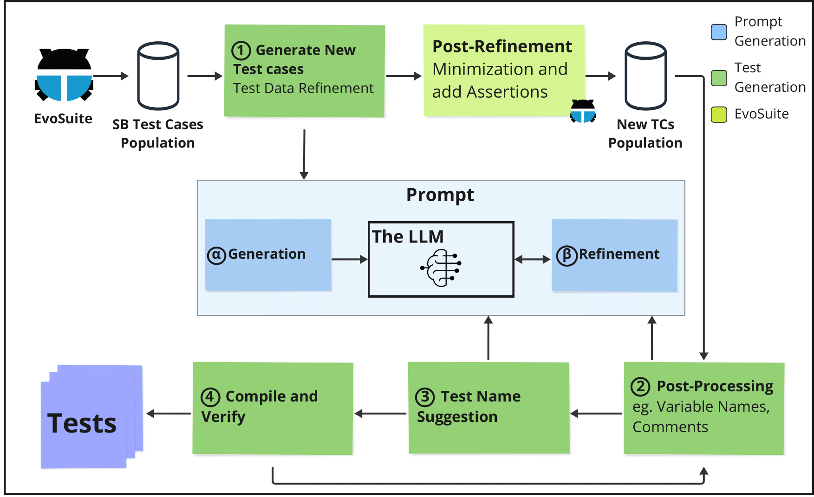

Hey There 👋

This will be my first post on my website, and I'm going to be starting with a bang! 

My first paper titled "Leveraging Large Language Models for Enhancing the Understandability of Generated Unit Tests" has been accepted at the International Conference on Software Engineering (ICSE) - 2025.



## Abstract

Automated unit test generators, particularly search-
based software testing tools like EvoSuite, are capable of generat-
ing tests with high coverage. Although these generators alleviate
the burden of writing unit tests, they often pose challenges for
software engineers in terms of understanding the generated tests.
To address this, we introduce UTGen, which combines search-
based software testing and large language models to enhance
the understandability of automatically generated test cases. We
achieve this enhancement through contextualizing test data,
improving identifier naming, and adding descriptive comments.
Through a controlled experiment with 32 participants from
both academia and industry, we investigate how the understand-
ability of unit tests affects a software engineer’s ability to perform
bug-fixing tasks. We selected bug-fixing to simulate a real-world
scenario that emphasizes the importance of understandable test
cases. We observe that participants working on assignments with
UTGen test cases fix up to 33% more bugs and use up to 20%
less time when compared to baseline test cases. From the post-test
questionnaire, we gathered that participants found that enhanced
test names, test data, and variable names improved their bug-
fixing process.

## The general architecture of UTGen



UTGen is an innovative approach designed to enhance the understandability of automatically generated unit tests by integrating **Search-Based Software Testing (SBST)** with **Large Language Models (LLMs)**. The architecture leverages the strengths of both SBST, which excels in generating high-coverage test cases, and LLMs, which improve the human readability of these tests. Below is an overview of how UTGen works:

### Key Components

1. **Test Data Refinement**  
   After SBST (via **EvoSuite**) generates initial test cases, UTGen refines the test data using an LLM. Traditional search-based methods often use random values, which lack meaningful context. UTGen's LLM-generated test data is domain-relevant, making the test cases more intuitive.

2. **Post-Processing: Naming and Commenting**  
   In this stage, the LLM is employed to improve the clarity of test cases by:
    - Generating descriptive comments using the "Given-When-Then" structure, which simplifies understanding by organizing the flow of the test scenario.
    - Enhancing variable names to reflect their roles in the test logic, improving the clarity of the code.

3. **Test Name Suggestions**  
   The LLM suggests descriptive names for test methods based on their behavior and assertions. For instance, rather than generic names like `testCreatesWeaponGameData`, UTGen produces names like `testEqualsWithDifferentMinDmgValues`, which better describe the purpose of the test.

4. **Compilation and Verification**  
   After refining the test cases, UTGen compiles the enhanced tests to ensure they are both syntactically correct and stable. If any test fails to compile, the process iterates, adjusting names or comments until the test case passes compilation.

### Benefits of UTGen
UTGen has demonstrated significant improvements in test case understandability. In controlled experiments, developers using UTGen's enhanced tests fixed more bugs and worked more efficiently than those using baseline EvoSuite-generated tests. The enhancements, particularly in naming, comments, and test data, made the tests easier to follow and reduced the time spent on debugging.

### Summary of the UTGen Pipeline
- **Search-Based Testing (SBST)** generates a population of tests using genetic algorithms.
- **LLM Integration** refines test data, enhances comments and names, and ensures logical and readable test structures.
- **Verification** ensures that the final test suite is both effective (high coverage) and understandable (clear naming, variable usage, and comments).

The integration of LLMs into the test generation pipeline bridges the gap between high-coverage but opaque test cases and the need for understandable, maintainable test suites in real-world software engineering.

## Access the Paper

You can access the paper [here (ArXiV)](https://arxiv.org/abs/2408.11710).

## Citing the Paper

```BibTeX
@misc{deljouyi2024leveraginglargelanguagemodels,
      title={Leveraging Large Language Models for Enhancing the Understandability of Generated Unit Tests}, 
      author={Amirhossein Deljouyi and Roham Koohestani and Maliheh Izadi and Andy Zaidman},
      year={2024},
      eprint={2408.11710},
      archivePrefix={arXiv},
      primaryClass={cs.SE},
      url={https://arxiv.org/abs/2408.11710}, 
}
```
